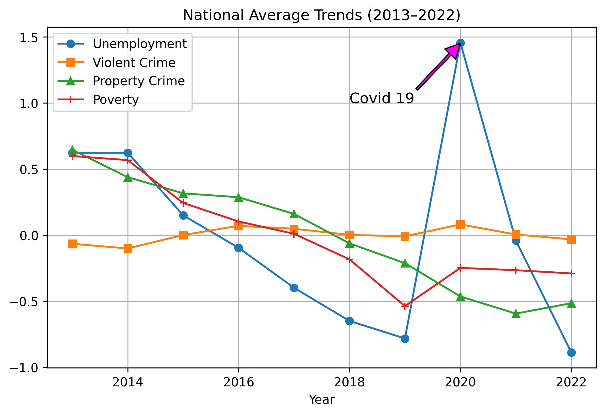
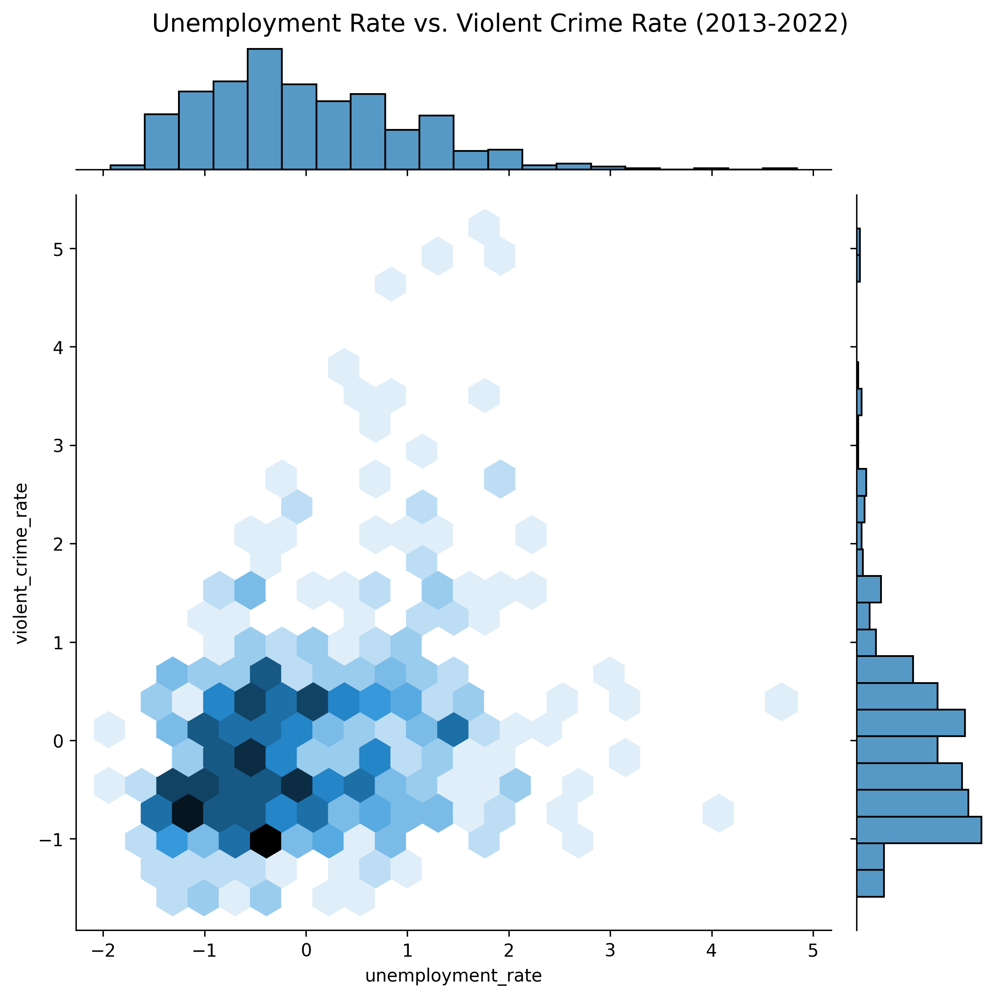
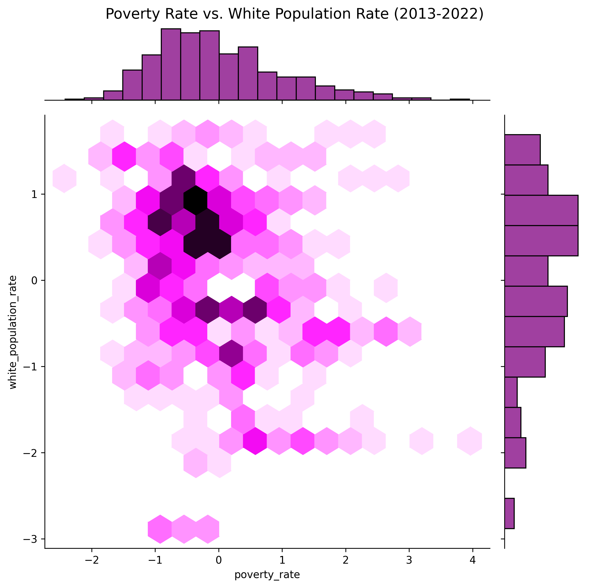
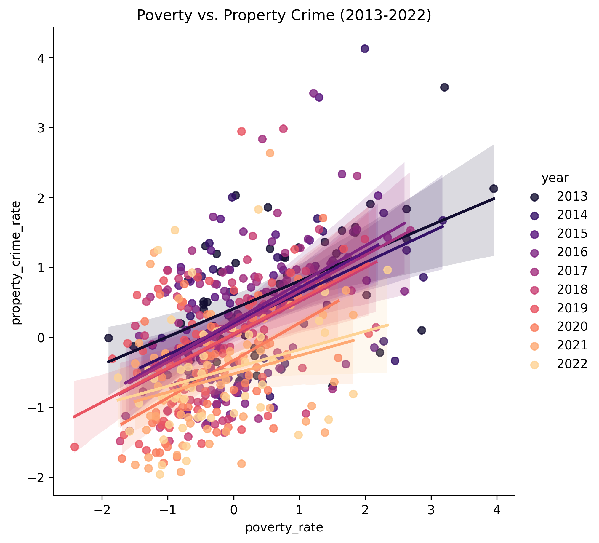
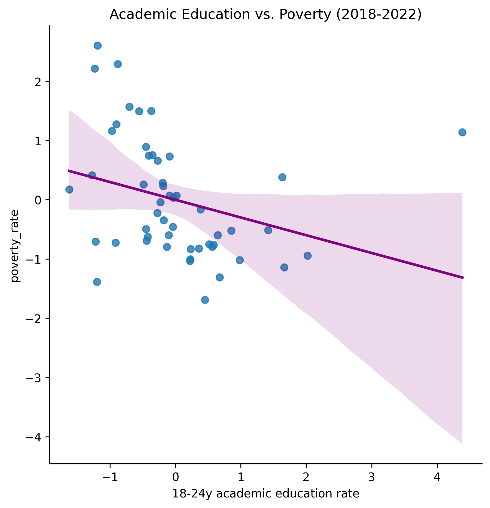
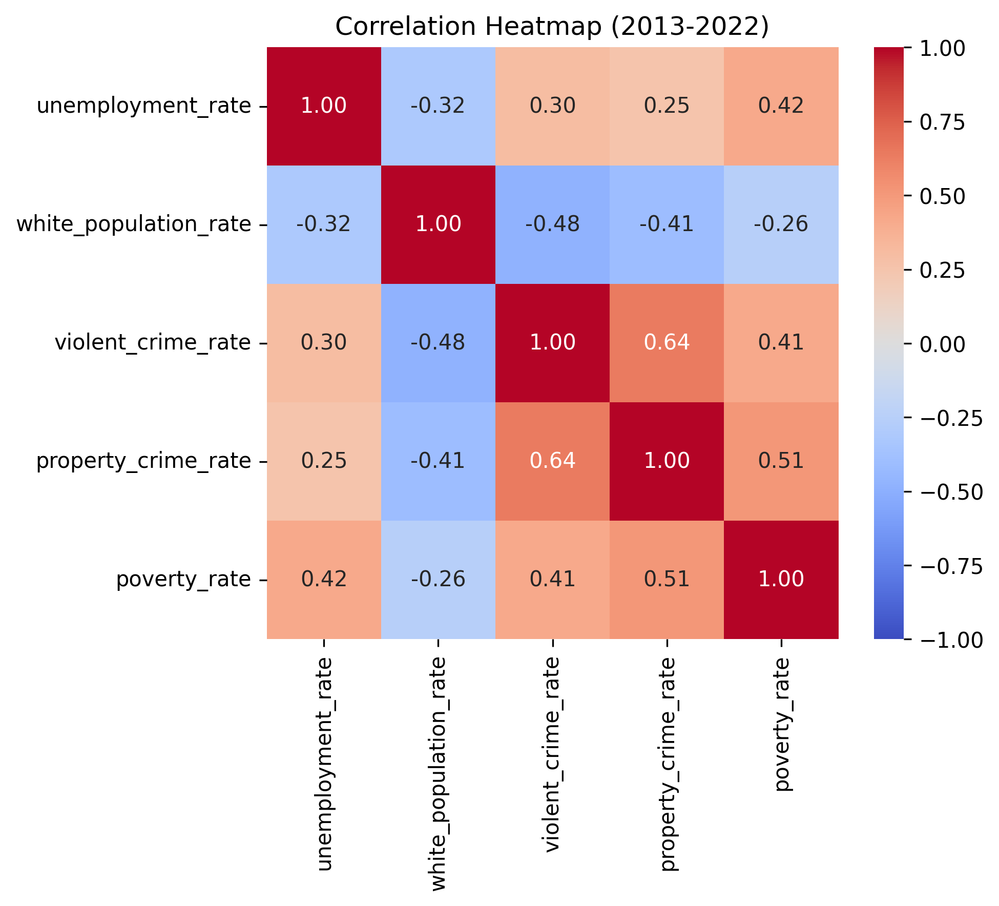

# 🗽 USA Crime & Socioeconomic Analysis (2013–2022)

📊 A data analysis project exploring relationships between crime rates, unemployment, poverty, race demographics, and education levels across U.S. states.

---

## 🎯 Project Goal

This project investigates how socioeconomic factors such as:
- 📉 Unemployment rate  
- 💰 Poverty rate  
- 👥 Population demographics  
- 🎓 Academic education levels  

relate to:
- 🚨 Violent crime rate  
- 🏚 Property crime rate  

across U.S. states from **2013 to 2022**.

---

## 📂 Datasets Used

- 🗺 Crime statistics (1979–2023 filtered to 2013–2022)
- 📉 U.S. unemployment rate (U-4 definition)
- 👤 White population percentage by state
- 🎓 Academic education rates (ages 18–24)
- 💰 Poverty rate by state

---

## 🧹 Data Processing Steps

✔ Removed unnecessary columns  
✔ Filtered years (2013–2022)  
✔ Handled missing values  
✔ Converted numeric strings to proper types  
✔ Interpolated demographic data  
✔ Merged multiple datasets into one unified dataset  
✔ Standardized features using `StandardScaler`

---

## 📊 Key Analyses

### 📈 National Crime Trends
- Yearly crime trends from 2013–2022
- COVID-19 impact observed in 2020 📉

### 🔍 Correlation Analysis
- Unemployment vs violent crime
- Poverty vs property crime
- Demographics vs socioeconomic factors

### 🧪 Statistical Testing
- Pearson correlation tests 📊
- T-tests comparing periods:
  - 2013–2017 vs 2018–2022

---

## 📉 Key Findings

- 📉 Crime rates do not show simple linear dependency on unemployment
- 💰 Poverty correlates more with property crime than violent crime
- 📊 Structural differences exist across states
- 🦠 COVID period shows noticeable statistical shifts

---

## 📌 Visualizations

### 📊 Crime Trends




### 💸Race vs Poverty


### 📉 Crime vs Poverty


### 👩🏻‍🎓 Academic Education vs Poverty


### 🔥 Correlation Heatmap


📝Make sure to check my project report for a more detailed analysis.

---

## 🧠 Technologies Used

- Python 🐍
- Pandas 🐼
- Matplotlib 📊
- Seaborn 🌊
- SciPy 💡
- Scikit-learn 🤖

---

## 📁 Files in This Repository

- `USA_crimes.ipynb` → Main analysis notebook  
- `data/` → Raw datasets  
- `images/` → Visualizations  
- `project_report.pdf` → Full academic report  
- `requirements.txt` → Dependencies  

---

## 🚀 Installation

Clone the repository:

```bash
git clone git@github.com:melofy-vibes/USA-Crime-Analysis.git
```

Move into the project directory:

```bash
cd USA-Crime-Analysis
```

Install dependencies:

```bash
pip install -r requirements.txt
```
---

## 👤 Author

Mehraveh Goharshadi

Data Analyst & Machine Learning Enthusiast
